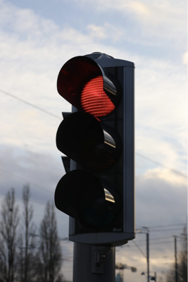

# Assignment 2
In this Assignment we have to open and image and apply various filters.
This is the Source Image
<div class="image-container">
  
</div>
These are the Filters

```python
filter_a = np.array([
    [0, -1, -1, -1, 0],
    [-1, 2, 2, 2, -1],
    [-1, 2, 8, 2, -1],
    [-1, 2, 2, 2, -1],
    [0, -1, -1, -1, 0]
])
# Filter B
filter_b = np.array([
    [1, 4, 6, 4, 1],
    [4, 16, 24, 16, 4],
    [6, 24, 36, 24, 6],
    [4, 16, 24, 16, 4],
    [1, 4, 6, 4, 1]
])
# Filter C
filter_c = np.array([
    [5, 5, 5, 5, 5],
    [5, 5, 5, 5, 5],
    [5, 5, 5, 5, 5],
    [5, 5, 5, 5, 5],
    [5, 5, 5, 5, 5]
])
# Filter D
filter_d = np.array([
    [0, -1, -1, -1, 0],
    [-1, 2, 2, 2, -1],
    [-1, 2, 16, 2, -1],
    [-1, 2, 2, 2, -1],
    [0, -1, -1, -1, 0]
])
```